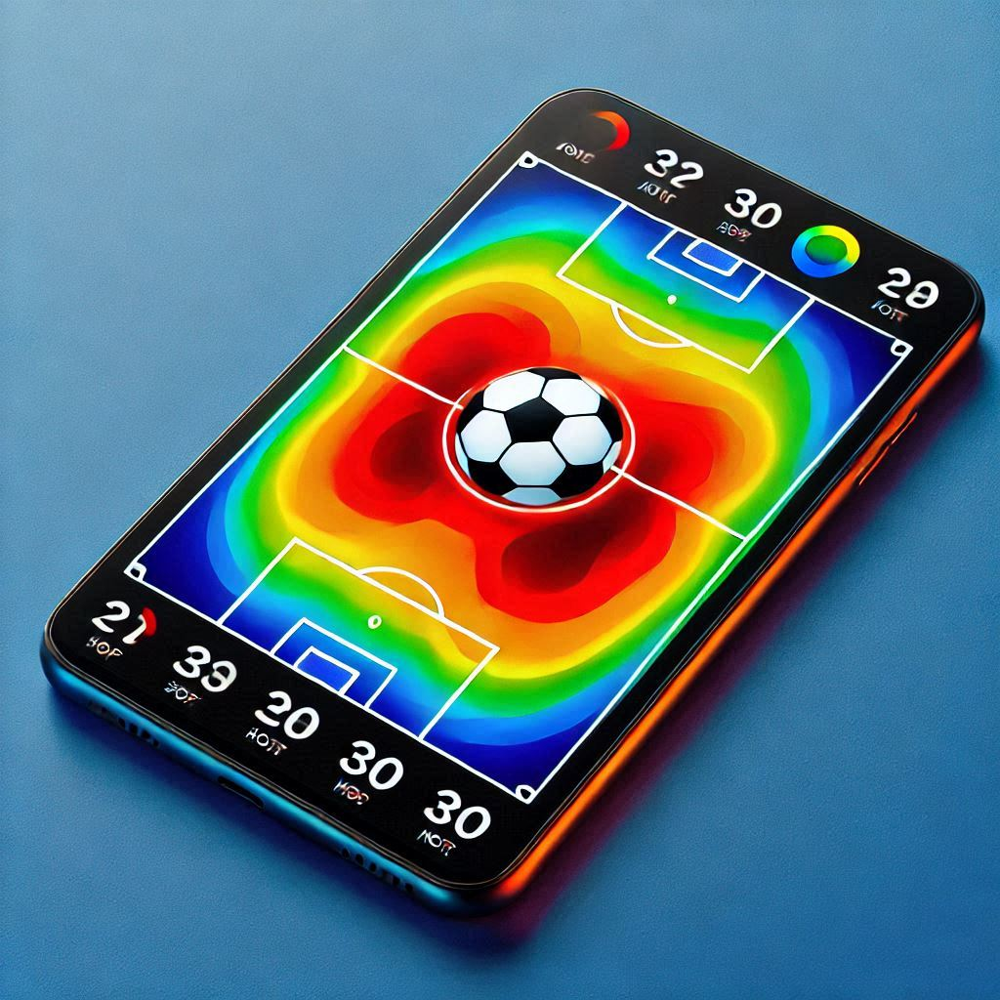
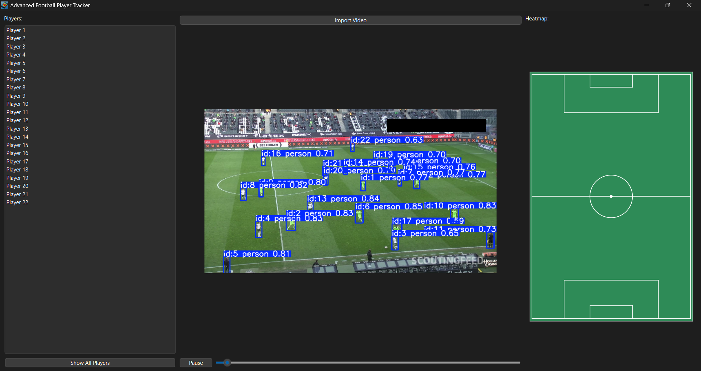
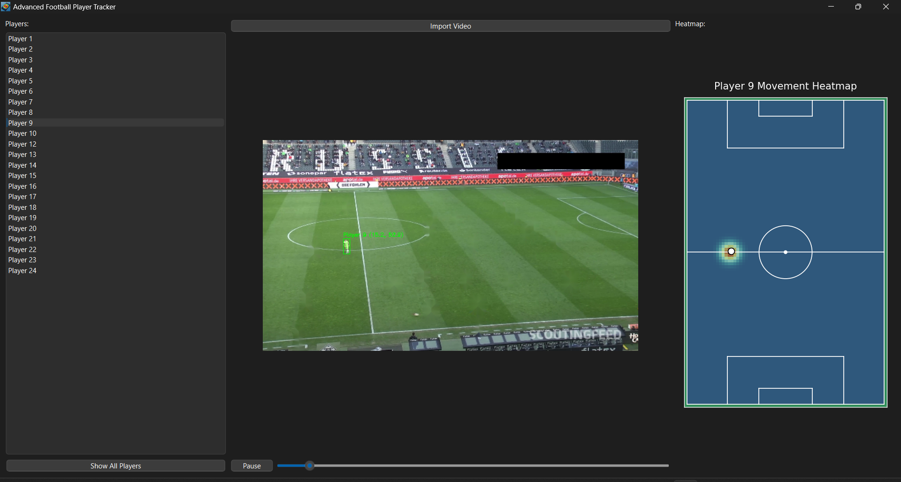

# ⚽ Football Heatmap Application 📊  

  

---  

## 🚀 Overview  

The **Football Heatmap Application** is a state-of-the-art, Python-based tool designed for analyzing football player movements. Featuring two distinct modes—**Preprocessing** and **Real-time Tracking**—it empowers users to generate insightful heatmaps of player activity, either beforehand or dynamically during video playback.  

Built with advanced machine learning 🤖 and a user-friendly interface 🎨, this application enables in-depth analysis of individual players. Users can isolate players, visualize their movements, and export heatmaps for further analysis—all seamlessly integrated into the app.  

---  

## ⭐ Key Features  

### 1. **Dual Modes of Operation**  
- 🕒 **Preprocessing Mode**:  
  - Processes entire videos in advance.  
  - Generates and saves static heatmaps for each player.  
  - Perfect for batch processing and large-scale analysis.  

- ⏱️ **Real-time Tracking Mode**:  
  - Tracks player movements dynamically during video playback.  
  - Updates heatmaps frame by frame for live insights.  
  - Ideal for real-time match analysis.  

### 2. **Advanced Player Isolation and Selection**  
- 🎯 Dynamically select players from an intuitive menu.  
- 🕵️‍♂️ Focus on individual players by hiding others.  
- 📈 Track and visualize exclusive player movements.  

### 3. **Heatmap Visualization**  
- 🌈 Enhanced with Gaussian smoothing for precision.  
- 🖼️ Export high-quality heatmaps for reports and presentations.  
- 🔄 View individual and cumulative heatmaps effortlessly.  

### 4. **Intuitive User Interface**  
- 🌟 Built with PyQt6 for a responsive, visually appealing experience.  
- Key features include:  
  - 👥 Player selection menu.  
  - 🎥 Video playback controls (play, pause, frame-by-frame navigation).  
  - 📊 Dynamic and seamless heatmap rendering.  

### 5. **Robust Error Handling**  
- ⚠️ Comprehensive error messages guide users through common issues, such as missing files or unsupported formats.  

### 6. **Cutting-edge Machine Learning Integration**  
- 🧠 Powered by YOLOv8 for real-time player detection.  
- 🌀 Ensures accurate tracking with DBSCAN clustering.  

---  

## 🎥 Visual Previews  

### 🔍 Real-time Tracking  
  

### 👥 Player Selection and Heatmap Visualization  
  

---  

## ⚙️ Installation Guide  

### Prerequisites  
- 🐍 Python 3.8 or later.  
- 📦 `pip` (Python package manager).  
- 🏟️ YOLOv8 model file (`yolov8m.pt`).  

### Steps  
1. **Clone the Repository**:  
   ```bash  
   git clone https://github.com/YourUsername/FootballHeatmapApp.git  
   cd FootballHeatmapApp  
   ```  

2. **Set Up a Virtual Environment**:  
   ```bash  
   python -m venv venv  
   source venv/bin/activate  # On Windows: venv\Scripts\activate  
   ```  

3. **Install Dependencies**:  
   ```bash  
   pip install -r requirements.txt  
   ```  

4. **Run the Application**:  
   - 🕒 For **Real-time Tracking Mode**:  
     ```bash  
     python app/Players_Heatmap_Real-timeproccessing.py  
     ```  
   - 🕐 For **Preprocessing Mode**:  
     ```bash  
     python app/Players_Heatmap_Preproccessing.py  
     ```  

---  

## 🛠️ Usage Workflow  

### Preprocessing Mode  
1. 🎬 Run the `Players_Heatmap_Preproccessing.py` script.  
2. 📂 Processed heatmaps are saved in the `heatmaps` folder.  

### Real-time Tracking Mode  
1. 🔴 Launch the `Players_Heatmap_Real-timeproccessing.py` script.  
2. 🕵️ Select players to visualize their movements live.  

---  

## 📝 Notes  
- Ensure the YOLOv8 model file (`yolov8m.pt`) is in the app's root directory.  
- Heatmaps from **Preprocessing Mode** are stored in the `heatmaps` folder.  
- Supported formats: `.mp4`, `.avi`, `.mkv`.  

---  

## 🤝 Contribution Guidelines  

We ❤️ contributions! To contribute:  
1. Fork the repository.  
2. Create a new branch for your feature or fix.  
3. Submit a pull request with a detailed explanation of your changes.  

---  

## 📜 License  

This project is licensed under the [MIT License](LICENSE).  

---  

## 👥 Meet the Team  

This project was developed by a talented team:  
- [**Sief Eldin Sameh**](https://github.com/SiefEldinSameh)  
- [**Fahd Ahmed**](https://github.com/fahdahmed10)  
- [**Ahmed Salem**](https://github.com/Ahmedo0oSalem)  
- [**Karim Farid**](https://github.com/eslamFared)  

---  

🔗 Explore the **Football Heatmap Application** and revolutionize your football analysis today! 🌟  

---  

